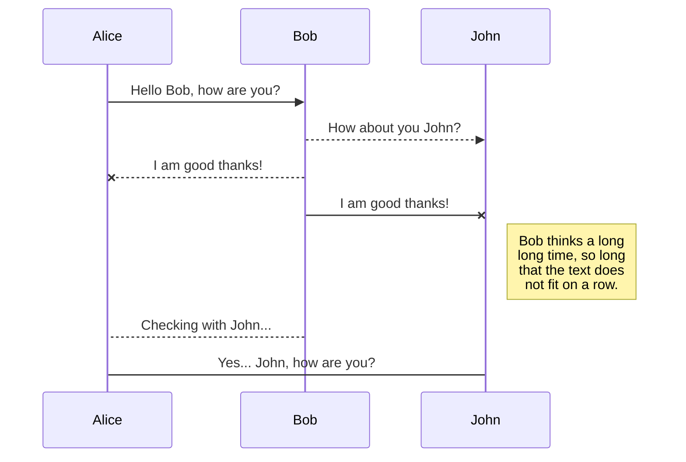
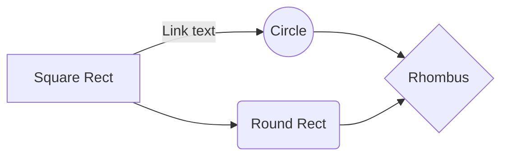

# Welcome to my portfolio

On this site, you'll find

- [ ] **My Biography**
I've always enjoyed exploring ideas that impact our lives in meaningful ways. The fact that I studied philosophy might give the impression that I'm more humanistically oriented. This conclusion would seem very plausible were it not for the fact that we're complex living beings with many layers of hidden possibilities.  
- [ ] **My projects**
My personal projects are mostly a direct reflection of my perspectives and professional experiences. I've been a technical writer for almost 10 years. But I wouldn't be able to go this far if I didn't have the help and support of many colleagues and collaborators I've had the opportunity to work with and learn from. To enlist all the projects I have worked in my career would be boring and unecessary. Therefore, I have decided to present the two most decisive ones in my journey.

What really matters to me in life is the fact that there are few things that really stick in our mind. One of them was the privilege of working with a team of experienced engineers to build a PaaS platform and write all the documentation, not only in terms of software, but also in terms of cloud computing technologies, like Kubernetes and Docker. And in order to do that, we had to map the whole process, tools, technologies and best practices.

1. To have participated in a big project of building and integrating a PaaS platform from the scratch.

For documentation, we had a few platforms to work with, such as GitHub, GitBook, Notion, Target Process, Slack, and other tools used in isolation. Among the best was AWK - it seemed to me to be one of the most powerful languages for dealing with large amounts of text. To scan, correct, format, and provide many other useful features. This is an introduction to my experience with AWK in an environment where large documents are created. And the need to process them is even more daring.



- [ ] **My resumé**

Take a look at some sample public domain structured documentation using GitBook - https://app.gitbook.com/s/L5ondDRPidoTsjjTFKI9/

# A Tutorial about integrating AWK with other tools

### Different Facets to Technical Writing ###

Technical writers and corporate communicators. Technical writers more often collaborate with subject matter experts (SMEs), such as engineers, technical experts, medical professionals, etc. to define and then create documentation to meet the user’s needs. Corporate communications includes other types of written documentation, for example:

| Type        | Description |
| ----------- | ----------- |
| Tutorial    | New user    |
| Thematic    | Intermediate|
| Reference   | Expext users|
| ----------- | ----------- |
| Explanation | In depth doc|
| How To      | Step by step|
| Readme      | Info about  |
| ----------- | ----------- |
| Docstring   | Source code |
| API         | Application |
| Dita XML    | Text author.|
| ----------- | ----------- |
| UML         | Language    |
| Sphinx      | Generator   |

- Market communications (MarCom): MarCom writers endeavor to convey the company’s value proposition through a variety of print, electronic, and social media. This area of corporate writing is often engaged in responding to proposals.
- Technical communication (TechCom): Technical writers document a company’s product or service. Technical publications may include user guides, installation and configuration manuals, and troubleshooting and repair procedures.
- Legal writing: This type of documentation is often prepared by attorneys or paralegals.
- Compliance documentation: This type of documentation codifies Standard Operating Procedures (SOPs), for any regulatory compliance needs, as for safety approval, taxation, financing, technical approval, and all the rest.
- Healthcare documentation: This field of documentation encompasses the timely recording and validation of events that have occurred during the course of providing healthcare assistance.

### Main factors of text processing with AWK ###

 - [ ] Speed
 - [ ] Time management
 - [ ] Coordination with staff and clients
 - [ ] Document quality
 - [ ] Automation

## Determine the audience's purpose for reading.
The audience is whoever uses the information in the document to achieve a purpose. The audience and its purpose determine document organization.

The four main audiences, and how each uses information:

 1. Experts give advice.
 2. Managers make decisions and plans.
 3. Operators follow instructions.
 4. General audience reads for information only.

## Identifying your purpose for writing
Try to answer, "what does the document do for you and your organization?" Consider the possibility that you may have more than one purpose for writing. If you have more than one purpose for writing, you most likely have more than one audience.

> **Warning**: Do not confuse the topic with your purpose for writing about it. *my purpose* is *to explain the functions of a new component* just discloses the topic. Instead, try to focus on what you achieve by explaning the topic: *I want the client to approve our set of functions, and I want the technical staff to develop a detailed design with the approved set of functions.

**Example**: There is an important difference between an *audience definition* and a *persona*. Many teams use personas to inform their design and development decisions. But a *persona* is a concrete characterization rather than a *well-defined audience type*. Both are valuable, but they are not the same thing.

Reliable and accessible documentation requires thorough product knowledge. It also, if not more, depends on knowing your audience.

Technical writers craft connections between an audience and a product. To build these connections, you need to identify your users as *clearly as possible* You also need to identify your user's goals: the problems they want to solve, the decisions they need to make, or the things they want to build.

Equipped with this audience awareness, you can write more accessible, well-situated, and supportive documentation. You can also help create *more satisfied customers*.

### How identifying audience can help a team ###

Your documentation audience is likely composed of users with different experience levels, business roles, or use cases. You may be surprised at how many audiences use your documents.

Getting a clearer and more nuanced picture of who reads your documentation can help teams and individual authors in many ways, from defining team responsibilities to information architecture to editing a sentence.

Here are some areas where audience analysis and understanding can help you and your team.

## Team structure, expertise, and responsibilities ##

Knowing your audience can help the team decide which writers to recruit or to hire. Understanding the customers who you serve helps you identify the areas of expertise or experience you should seek when you are hiring.

Audience analysis can also help to identify learning opportunities for current team members. Writers might need to become more familiar with a certain kind of use case, external developer framework, or some aspect of the company's product line in order to better serve the users consulting the docs.

Audience can also play an important role when you're determining how to assign information development work. Certain writers might have particular familiarity with specific sections of the audience, such as app developers, data analysts, or system administrators, which will make them better suited to shape documentation structure and content for those users.  

# User testing and feedback
Your team might also conduct documentation user testing. Understanding your audience can help with identifying representative users to provide feedback on the docs.

User feedback can provide other important audience insights. Comments or questions can highlight particular use cases, business roles, or areas of interest among your readers.   

## Delivery format
Knowing your audience can influence the publication or delivery format for your users team's documentation. Your audience might comprise users who prefer online documentation, users who prefer printed versions, or both. Making a printable option available can make online documentation more accessible for all users.

If your team creates online documentation, audience awareness can also help with determining whether the UI and other aspects of the online suit users' needs. Are users satisfied with available options for navigating, searching, and reading the docs? If your audience includes users who consume the docs on desktop computers and mobile devices, is your content accessible and correctly formatted for both platforms?

## Information architecture and learning objectives

You can save any file of the workspace to **Google Drive**, **Dropbox** or **GitHub** by opening the **Synchronize** sub-menu and clicking **Save on**. Even if a file in the workspace is already synced, you can save it to another location. StackEdit can sync one file with multiple locations and accounts.

## Synchronize a file

Once your file is linked to a synchronized location, StackEdit will periodically synchronize it by downloading/uploading any modification. A merge will be performed if necessary and conflicts will be resolved.

If you just have modified your file, and you want to force syncing, click the **Synchronize now** button in the navigation bar.

> **Note:** The **Synchronize now** button is disabled if you have no file to synchronize.

## Manage file synchronization

Since one file can be synced with multiple locations, you can list and manage synchronized locations by clicking **File synchronization** in the **Synchronize** sub-menu. This allows you to list and remove synchronized locations that are linked to your file.

# Publication

Publishing in StackEdit makes it simple for you to publish online your files. Once you're happy with a file, you can publish it to different hosting platforms like **Blogger**, **Dropbox**, **Gist**, **GitHub**, **Google Drive**, **WordPress** and **Zendesk**. With [Handlebars templates](http://handlebarsjs.com/), you have full control over what you export.

> Before starting to publish, you must link an account in the **Publish** sub-menu.

## Publish a File

You can publish your file by opening the **Publish** sub-menu and by clicking **Publish to**. For some locations, you can choose between the following formats:

- Markdown: publish the Markdown text on a website that can interpret it (**GitHub** for instance),
- HTML: publish the file converted to HTML via a Handlebars template (on a blog for example).

## Update a publication

After publishing, StackEdit keeps your file linked to that publication, which makes it easy for you to re-publish it. Once you have modified your file, and you want to update your publication, click on the **Publish now** button in the navigation bar.

> **Note:** The **Publish now** button is disabled if your file has not been published yet.

## Manage file publication

Since one file can be published to multiple locations, you can list and manage publish locations by clicking **File publication** in the **Publish** sub-menu. This allows you to list and remove publication locations that are linked to your file.

# Markdown extensions

StackEdit extends the standard Markdown syntax by adding extra **Markdown extensions**, providing you with some nice features.

> **ProTip:** You can disable any **Markdown extension** in the **File properties** dialog.

## SmartyPants

SmartyPants converts ASCII punctuation characters into "smart" typographic punctuation HTML entities. For example:

|                |ASCII                          |HTML                         |
|----------------|-------------------------------|-----------------------------|
|Single backticks|`'Isn't this fun?'`            |'Isn't this fun?'            |
|Quotes          |`"Isn't this fun?"`            |"Isn't this fun?"            |
|Dashes          |`-- is en-dash, --- is em-dash`|-- is en-dash, --- is em-dash|

> You can find more information about **LaTeX** mathematical expressions [here](http://meta.math.stackexchange.com/questions/5020/mathjax-basic-tutorial-and-quick-reference).

## UML diagrams

You can render UML diagrams using [Mermaid](https://mermaidjs.github.io/). For example, this will produce a sequence diagram:

And this will produce a flow chart:

